<p align="center">
  
</p>

<h1 align="center">GitLab Assistant Skills</h1>

<table align="center">
<tr>
<td align="center">
<h2>19</h2>
<sub>Specialized skills<br>one conversation</sub>
</td>
<td align="center">
<h2>100%</h2>
<sub>glab CLI coverage<br>plus raw API</sub>
</td>
<td align="center">
<h2>0</h2>
<sub>API syntax<br>to memorize</sub>
</td>
<td align="center">
<h2>10</h2>
<sub>New API skills<br>in v1.1.0</sub>
</td>
</tr>
</table>

<p align="center">
  
  
  
  
  
</p>

<p align="center">
  <strong>Natural language GitLab automation for Claude Code</strong><br>
  <sub>From merge requests to vulnerability management—19 skills, zero syntax memorization.</sub>
</p>

<div align="center">

```
┌───────────────────────────────────────────────────────────────┐
│ You: "What MRs need my review?"                               │
├───────────────────────────────────────────────────────────────┤
│ Claude: Found 3 merge requests awaiting your review:          │
│                                                               │
│ !142 feat: Add user authentication                            │
│     → Author: @sarah | +523/-89 | 2 approvals needed          │
│                                                               │
│ !138 fix: Resolve race condition in worker                    │
│     → Author: @mike | +12/-4 | Pipeline passed ✓              │
│                                                               │
│ !135 docs: Update API documentation                           │
│     → Author: @alex | +234/-56 | Ready to merge               │
│                                                               │
│ Would you like me to check out any of these for review?       │
└───────────────────────────────────────────────────────────────┘
```

</div>

<p align="center">
  <a href="#quick-start"><strong>Get Started</strong></a> •
  <a href="#skills-overview">Skills</a> •
  <a href="#who-is-this-for">Use Cases</a> •
  <a href="#architecture">Architecture</a>
</p>

---

## The Difference

<table>
<tr>
<td width="50%">

### ❌ The CLI Way
```bash
glab mr list --reviewer=@me --state=open
glab mr view 142
glab mr checkout 142
glab mr approve 142
glab ci status
```
*Five commands, context switching...*

</td>
<td width="50%">

### ✅ The Natural Way
```
"Show MRs I need to review, check out
the auth one, and approve if CI passes"
```
*Just ask.*

</td>
</tr>
</table>

### Time Saved

| Task | Traditional CLI | GitLab Assistant | Saved |
|------|-----------------|------------------|-------|
| Find MRs to review | 30 seconds | 5 seconds | 83% |
| Create MR with description | 2 minutes | 15 seconds | 88% |
| Check pipeline + view logs | 1 minute | 10 seconds | 83% |
| Search code across projects | 45 seconds | 8 seconds | 82% |
| Set up branch protection | 3 minutes | 20 seconds | 89% |

---

## Quick Start

### 1. Install glab CLI

```bash
# macOS
brew install glab

# Linux
brew install glab
# or: https://gitlab.com/gitlab-org/cli/-/releases

# Windows
winget install glab
```

### 2. Authenticate

```bash
glab auth login
# Follow the prompts to authenticate with GitLab
```

### 3. Clone This Repository

```bash
git clone https://github.com/grandcamel/GitLab-Assistant-Skills.git
```

### 4. Add to Claude Code

Add to your `~/.claude/settings.json`:

```json
{
  "plugins": [
    "/path/to/GitLab-Assistant-Skills/.claude-plugin"
  ]
}
```

### 5. Start Using

```bash
claude "Show my open merge requests"
claude "Create an issue for the login bug"
claude "What's the pipeline status?"
```

**That's it.** Claude now has full GitLab access via natural language.

---

## Skills Overview

### Core Skills (glab CLI)

| Skill | Purpose | Example |
|-------|---------|---------|
| **gitlab-assistant** | Hub router | Routes to the right skill automatically |
| **gitlab-mr** | Merge requests | "Create MR from feature branch" |
| **gitlab-issue** | Issues | "Show my open bugs" |
| **gitlab-ci** | CI/CD pipelines | "Why did the pipeline fail?" |
| **gitlab-repo** | Repositories | "Clone the backend project" |
| **gitlab-release** | Releases | "Create release v2.0.0" |
| **gitlab-label** | Labels | "Add 'urgent' label to issue 42" |
| **gitlab-milestone** | Milestones | "Show Q1 milestone progress" |
| **gitlab-variable** | CI/CD variables | "Set DATABASE_URL variable" |

### API Skills (glab api) — New in v1.1.0

| Skill | Purpose | Example |
|-------|---------|---------|
| **gitlab-group** | Groups & members | "Add @sarah to backend team" |
| **gitlab-search** | Global search | "Find TODO comments in code" |
| **gitlab-protected-branch** | Branch protection | "Protect main branch" |
| **gitlab-webhook** | Webhooks | "Create webhook for Slack" |
| **gitlab-file** | Repository files | "Get contents of config.yaml" |
| **gitlab-wiki** | Wiki pages | "Create wiki page for API docs" |
| **gitlab-discussion** | Discussions | "Reply to thread on MR !42" |
| **gitlab-badge** | Project badges | "Add pipeline status badge" |
| **gitlab-container** | Container registry | "List container images" |
| **gitlab-vulnerability** | Security (Ultimate) | "Show critical vulnerabilities" |

---

## Who Is This For?

<details>
<summary><strong>👨‍💻 Developers</strong> — Never leave your terminal</summary>

### Developer Workflow

```bash
# Start your day
claude "What's assigned to me?"

# Work on features
claude "Create branch and MR for issue #42"
claude "Check if CI passed on my MR"

# Code review
claude "Show MRs waiting for my review"
claude "Approve MR !138 with comment 'LGTM'"

# End of day
claude "What did I merge today?"
```

**Time saved:** ~30 min/week

</details>

<details>
<summary><strong>👥 Team Leads</strong> — Team visibility in seconds</summary>

### Team Management

```bash
# Morning standup prep
claude "Show open MRs for my team"
claude "What's blocked in the current milestone?"

# Sprint planning
claude "Show unassigned issues in backlog"
claude "Create milestone for next sprint"

# Code review management
claude "Which MRs have been open > 3 days?"
```

**Time saved:** ~2 hours/week

</details>

<details>
<summary><strong>🔧 DevOps Engineers</strong> — Pipeline management simplified</summary>

### DevOps Workflow

```bash
# Pipeline monitoring
claude "Show failed pipelines this week"
claude "Why did job 'test' fail in pipeline 12345?"
claude "Retry failed jobs in latest pipeline"

# Release management
claude "Create release v2.1.0 from main"
claude "What commits are in this release?"

# Infrastructure
claude "Set CI variable DEPLOY_ENV=production"
claude "Show container images in registry"
```

**Time saved:** ~1 hour/week

</details>

<details>
<summary><strong>🛡️ Security Teams</strong> — Vulnerability management (Ultimate)</summary>

### Security Workflow

```bash
# Vulnerability triage
claude "Show critical vulnerabilities"
claude "What CVEs affect our projects?"

# Remediation tracking
claude "Dismiss false positive vuln #123"
claude "Show resolved vulnerabilities this month"

# Compliance
claude "Export vulnerability report"
```

**Requires:** GitLab Ultimate

</details>

---

## Architecture

```mermaid
flowchart TD
    U["👤 User Request"] --> CC["🤖 Claude Code"]
    CC --> GA["📋 gitlab-assistant<br/>Hub Router"]

    GA -->|"MR operations"| MR["gitlab-mr"]
    GA -->|"Issue tracking"| IS["gitlab-issue"]
    GA -->|"Pipeline/CI"| CI["gitlab-ci"]
    GA -->|"Repository"| RE["gitlab-repo"]
    GA -->|"Search code"| SE["gitlab-search"]
    GA -->|"Groups/Teams"| GR["gitlab-group"]
    GA -->|"Security"| VU["gitlab-vulnerability"]

    subgraph CLI["glab CLI"]
        MR & IS & CI & RE
    end

    subgraph API["glab api (REST)"]
        SE & GR & VU
    end

    CLI --> GL[("☁️ GitLab")]
    API --> GL
```



### How It Works

1. **Hub Routing** — `gitlab-assistant` analyzes your request and routes to the appropriate skill
2. **CLI Skills** — Use native `glab` commands for common operations (MRs, issues, CI)
3. **API Skills** — Use `glab api` for advanced operations not covered by CLI
4. **Safeguards** — Risk levels and confirmation prompts for destructive operations

---

## Skill Categories

### By Risk Level

| Risk | Skills | Description |
|:----:|--------|-------------|
| **-** | search | Read-only operations |
| **⚠️** | mr, issue, ci, repo, label, milestone, wiki, discussion, badge | Single-item modifications |
| **⚠️⚠️** | variable, container, protected-branch | Bulk or sensitive operations |
| **⚠️⚠️⚠️** | (none currently) | Irreversible operations (require confirmation) |

### By GitLab Tier

| Tier | Skills |
|------|--------|
| **Free** | All core skills (mr, issue, ci, repo, etc.) |
| **Premium** | protected-branch (advanced rules), group (advanced) |
| **Ultimate** | vulnerability (security scanning) |

---

## Configuration

### Environment Variables

| Variable | Description |
|----------|-------------|
| `GITLAB_TOKEN` | Personal access token (alternative to `glab auth`) |
| `GITLAB_HOST` | Self-managed GitLab instance URL |

### Self-Managed GitLab

```bash
glab auth login --hostname gitlab.company.com
```

---

## Documentation

| Resource | Description |
|----------|-------------|
| [Quick Reference](skills/shared/docs/QUICK_REFERENCE.md) | Command cheat sheet |
| [API Helpers](skills/shared/docs/API_HELPERS.md) | Raw API patterns |
| [Safeguards](skills/shared/docs/SAFEGUARDS.md) | Risk levels and safety |

### Need Help?

- 💬 [GitHub Discussions](https://github.com/grandcamel/GitLab-Assistant-Skills/discussions)
- 🐛 [Report Issues](https://github.com/grandcamel/GitLab-Assistant-Skills/issues)

---

## What's New in v1.1.0

**10 new API-based skills** for features not covered by native `glab` commands:

- **Group management** — Members, subgroups, sharing
- **Global search** — Code, issues, MRs across all projects
- **Branch protection** — Access rules, required approvals
- **Webhooks** — CRUD and test triggers
- **Repository files** — Read/write via API
- **Wiki pages** — Documentation management
- **Discussions** — Threaded comments on MRs/issues
- **Badges** — Pipeline, coverage, custom badges
- **Container registry** — Image and tag management
- **Vulnerabilities** — Security finding management (Ultimate)

---

## Contributing

Contributions welcome!

```bash
# Clone and explore
git clone https://github.com/grandcamel/GitLab-Assistant-Skills.git
cd GitLab-Assistant-Skills

# Structure
skills/           # Skill definitions (markdown)
.claude-plugin/   # Plugin manifest
```

---

## License

MIT License — see [LICENSE](LICENSE) for details.

---

<p align="center">
  <strong>Stop memorizing glab commands. Start talking to GitLab.</strong>
  <br>
  <sub>Built for Claude Code by developers who wanted GitLab without the context switching.</sub>
</p>
